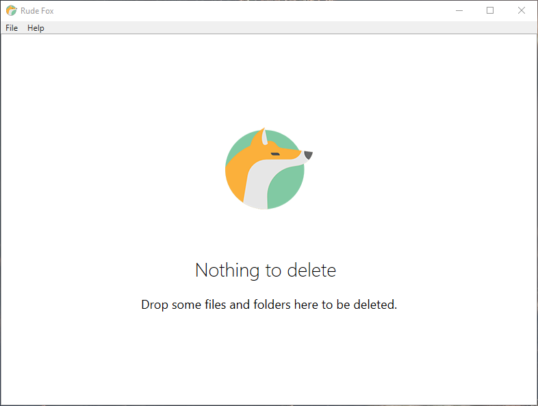
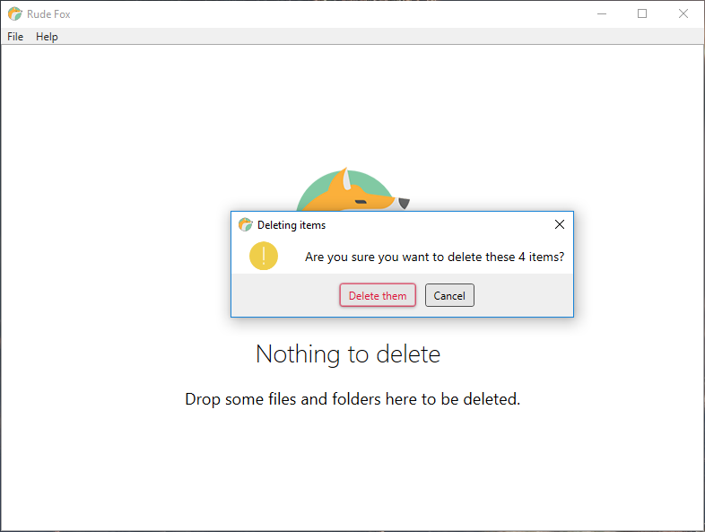
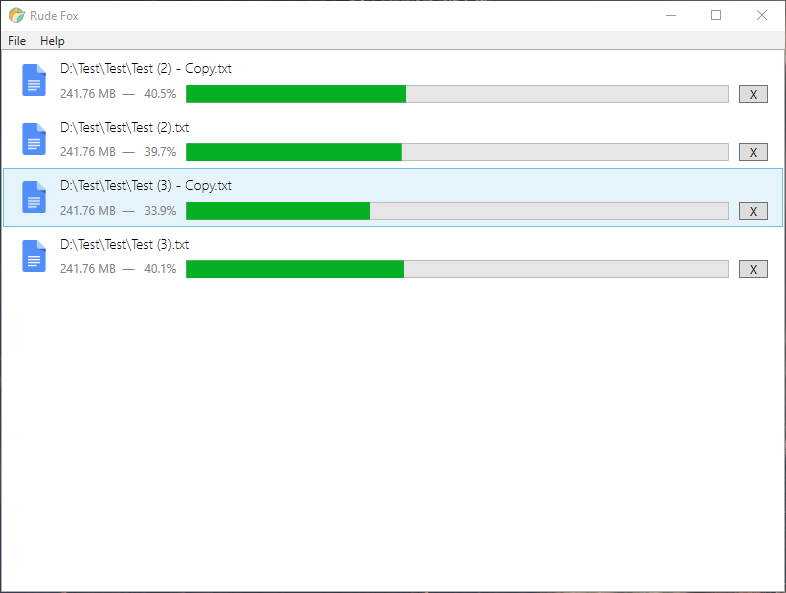

# Rude Fox :cat:
A simple Windows app to delete files and folders permanently, You can **[download](https://github.com/encrypt0r/RudeFox/releases)** the latest release and give it a try.

To delete one or more item, simply drag and drop them into the main window, then grab a bag of popcorn and enjoy :smile:

**Note:** It needs .Net Framework 4.5 to run which you can download [here](https://www.microsoft.com/en-us/download/details.aspx?id=30653).

## Screen Shots

### Main Window

### Delete Confirmation

### You can delete multiple items simultaneously
