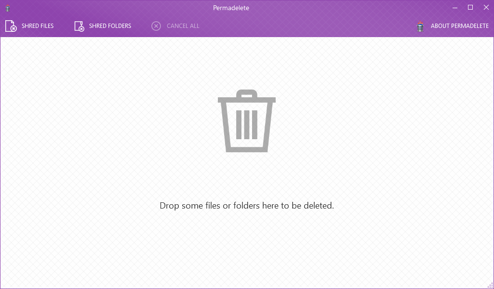

After you **[downloaded](https://github.com/encrypt0r/permadelete/releases)** the latest release and gave it a try, read [this short tutorial](https://github.com/encrypt0r/permadelete/wiki/How-to-use-Permadelete) about 3 fun ways to shred files permanently using Permadelete. And if you are the curious type, you can read about [how Permadelete works](https://github.com/encrypt0r/permadelete/wiki/How-Permadelete-works). We welcome everyone who wants to help us in any way they can :grin: Please contact me if you are interested.

**Note:** It needs .Net Framework 4.5 to run which you can download [here](https://www.microsoft.com/en-us/download/details.aspx?id=30653).

## Resources
Here are a list of projects and articles that have been very helpful in developing Permadelete:
- [Secure Delete](https://github.com/bitbeans/securedelete-net) by @bitbeans
- [Data evaopration on SSDs](https://www.youtube.com/watch?v=zG0orMGf_Go) by Sam Bowne
- [The urban legend of multipass hard disk overwrite and DoD 5220-22-M](http://web.archive.org/web/20121110053501/http://grot.com/wordpress/?p=154) by Brian Smithson

## Special Thanks
I'd like to thank everyone who has helped me in developing and testing Permadelete, I'd also like to thank these awesome companies who have donated a license of their invaluable products to the project:
- [Icons8.com](https://icons8.com) for beautiful icons.
- [Sentry.io](https://sentry.io) for analytics and crash reports.

## Contact
You can contact via my email: [**encryptor@outlook.com**](mailto:encryptor@outlook.com)

A [DevelopersTree.com](https://developerstree.com/) project.