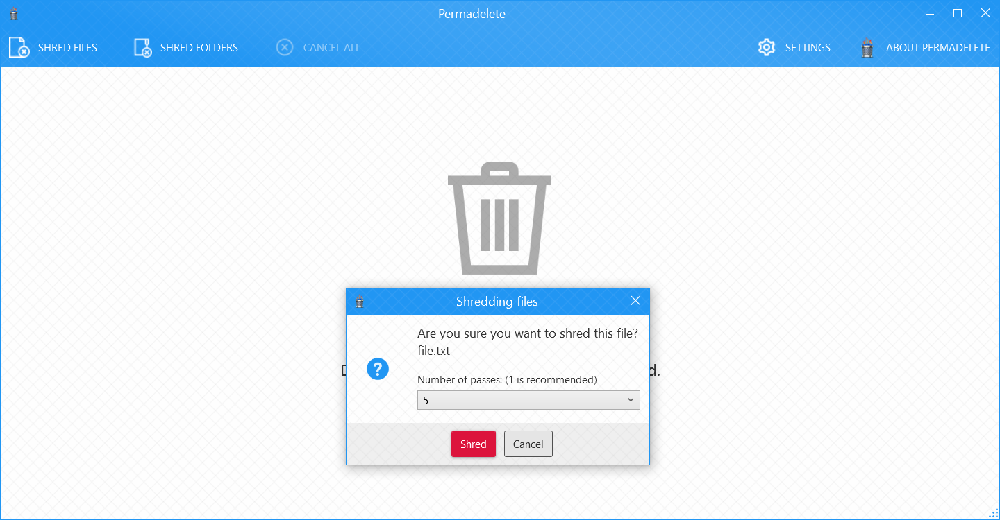

# Rude Fox :cat:
A simple Windows app to delete files and folders permanently, You can **[download](https://github.com/encrypt0r/RudeFox/releases)** the latest release and give it a try.

To delete one or more item, simply drag and drop them into the main window, then grab a bag of popcorn and enjoy :smile:

**Note:** It needs .Net Framework 4.5 to run which you can download [here](https://www.microsoft.com/en-us/download/details.aspx?id=30653).

## How to use
Open the app and grab stuff inside the main window, then click "Delete them"

## Credits
These projects and articles have been very helpful in developing Rude Fox:
+ [Secure Delete](https://github.com/bitbeans/securedelete-net) by @bitbeans
+ [Data evaopration on SSDs](https://www.youtube.com/watch?v=zG0orMGf_Go) by Sam Bowne
+ [The urban legend of multipass hard disk overwrite and DoD 5220-22-M](http://web.archive.org/web/20121110053501/http://grot.com/wordpress/?p=154) by Brian Smithson
